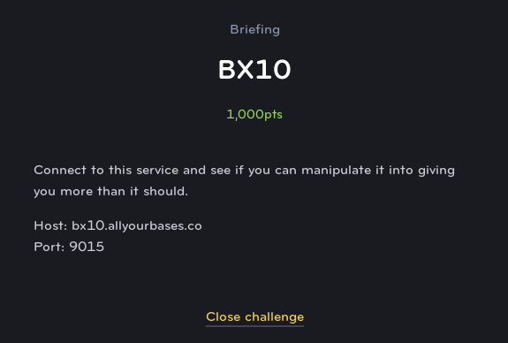

# BX10
# Binary Exploit (Extreme)



This challenge is another buffer overflow exploit however in this case we do not get access to a local executable, so we are forced to just submit our payloads directly to the server.

I didn't get a screenshot of the output from the server but if you put in a large input, it prints an error message stating that there was a segmentation fault (indicating that the buffer overflow was effective) and then a message stating that you can **"trace the read_flag() function at 0x87567" (or some similar address)**

So next you can try to send a payload with that address and see how it works:

```
python -c "print 'A'*120+'\x67\x75\x08'" | nc bx10.allyourbases.co 9015
```

This will print a similar message as before except you'll see now that the address for the **read_flag()** function has changed. This is because the developers have enabled Address Space Layout Randomization (a common anti-buffer overflow exploit feature). However it appears that the address space is generall pretty small because you may see some addresses repeat.

So now it just becomes a brute force game where we continue in hopes that the payload address matches the real address of the function. You can do this using a bash script and then read through the output and see if it worked:

```
for i in {0..100}
do
  python -c "print 'A'*120+'\x67\x75\x08'" nc bx10.allyourbases.co 9015 >> output.txt
done
```

After this completes, you should hopefully see one attempt where it successfully matched the remote address and the flag is printed.
