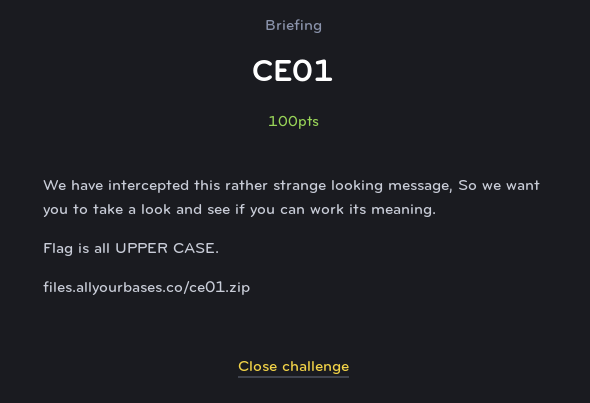
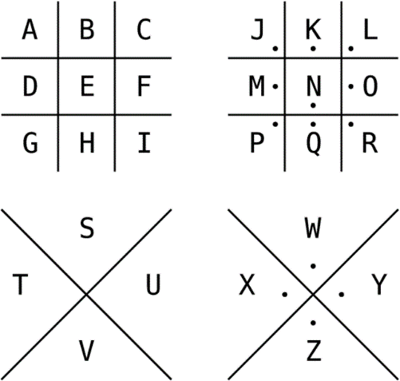

#CE01
#Cryptography (Easy)

For this challenge, we are given an image with some sort of encoded message in it. 

Crypto nerds will immediately recognize the Pigpen cipher (below). Each shape in the cipher can be looked up on the chart below to see the accompanying letter.

