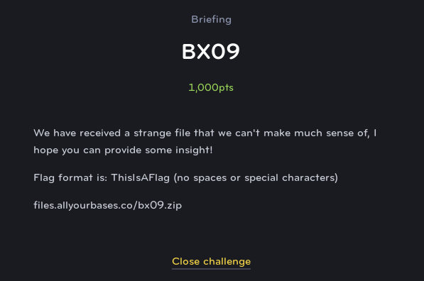
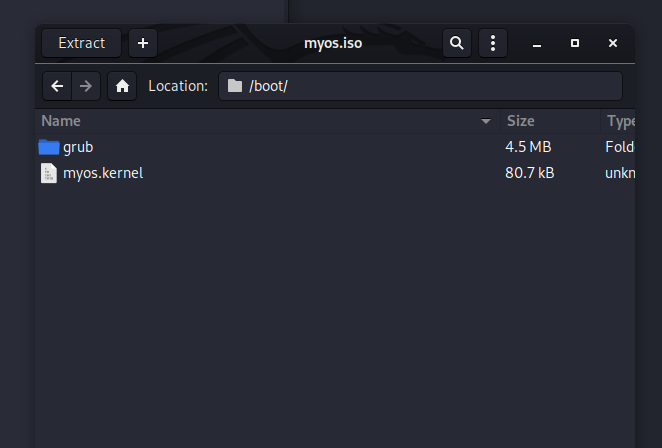
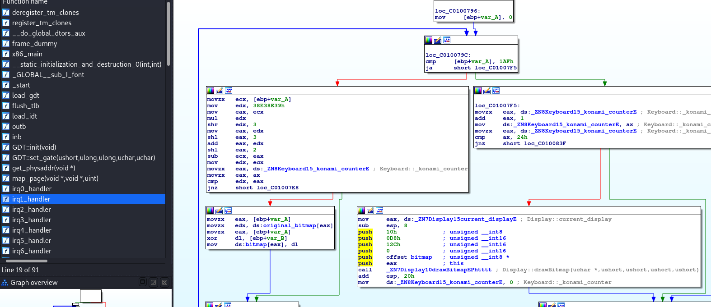
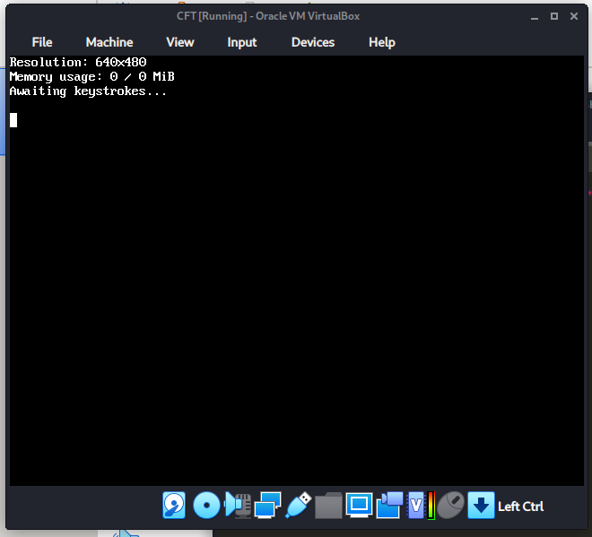
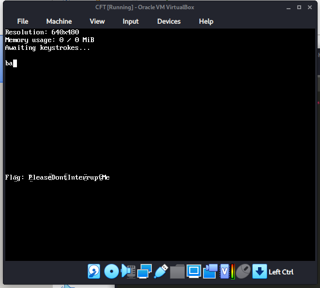

# BX09
## Binary Exploit (Extreme)

This challenge is very unique because you have to actually boot up a homebrew OS and examine how it functions to discover the flag.

You can open the provided ISO image in an archive manager and see the kernel itself which can be opened up in IDA to examine how it functions.

Looking at the kernel code, nothing really stands out immediately. However, there are a series of interrupt handlers that we can see it accepting input from the keyboard. In the function **irq1_handler()**, we finally see a really good hint. There are several references to functions which include the word "konami". Anyone with nerd cred will immediately think of the famous "Konami Code", so let's give it a shot...

After creating a simple virtual machine in VirtualBox, and mounting the ISO in the virtual CD drive, we can finally boot up the OS and are presented with a simple screen, waiting for input.

Here we can enter the konami code on the keyboard: up up down down left right left right B A

This reveals the flag **PleaseDontInterruptMe**

