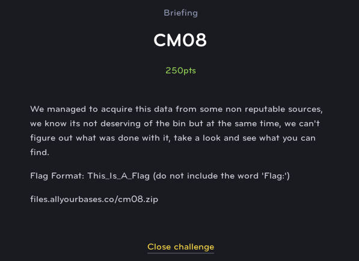
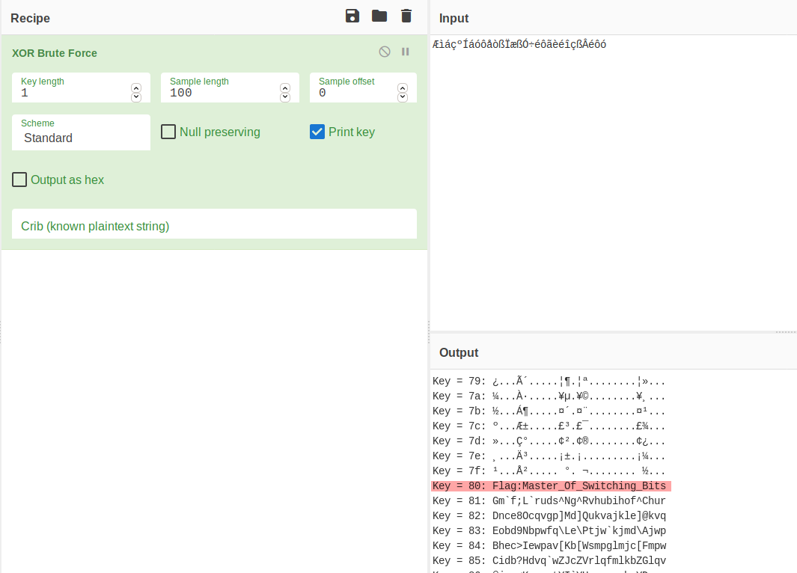

# CM08
## Crypto (Medium)

For this challenge we are provided with a text file, however the text is unreadable.

* [CM08.txt](CM08.txt)

Using a tool like [CyberChef](https://gchq.github.io/CyberChef/), we are able to try some different methods for decoding the text. One favorite method of many CTFs is to XOR each byte with some value (or series of values) to hide the flag in plain site. Using the CyberChef XOR Brute-Force Tool, we can confirm that is exactly the case using the value 0x80 as the key.

The flag is: **Master_Of_Switching_Bits**

