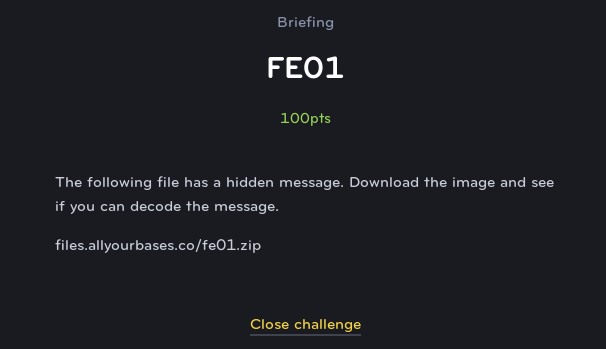
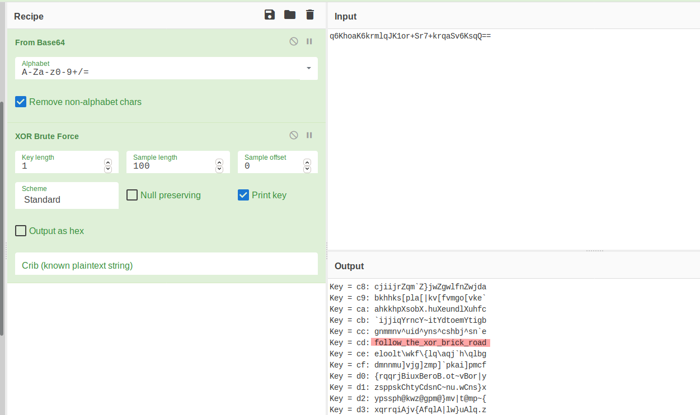

# FE01
## Forensics (Easy)

For this challenge, we are provided with the following image and are told that it contains a message somehow.

Examining the file using `strings -n 10 FE01.jpg`, we can see the following base64 string:

**q6KhoaK6krmlqJK1or+Sr7+krqaSv6KsqQ==**

Running this through a decoder, outputs a bunch of gibberish:

**«¢¡¡¢º’¹¥¨’µ¢¿’¯¿¤®¦’¿¢¬©**

Instead, we could convert it to hex and then try some different logical operations:

**ab a2 a1 a1 a2 ba 92 b9 a5 a8 92 b5 a2 bf 92 af bf a4 ae a6 92 bf a2 ac a9**

Using Cyberchef, along with the XOR Brute-Force tool, we are able to decode the flag, **follow_the_xor_brick_road**

