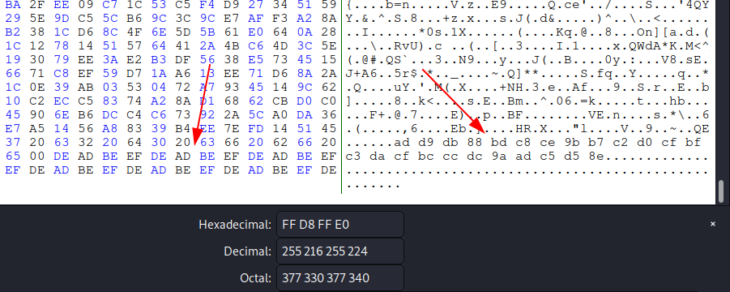
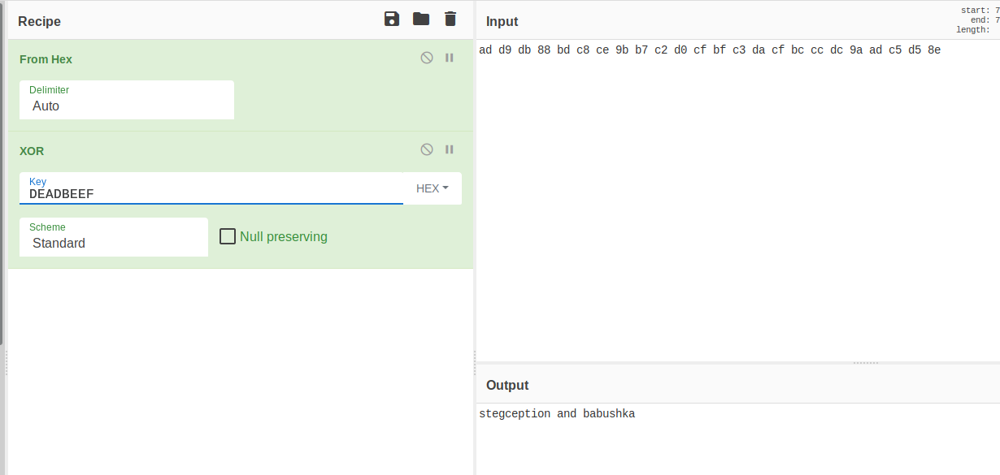
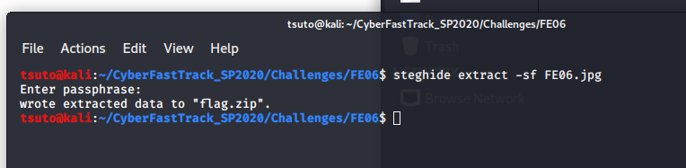
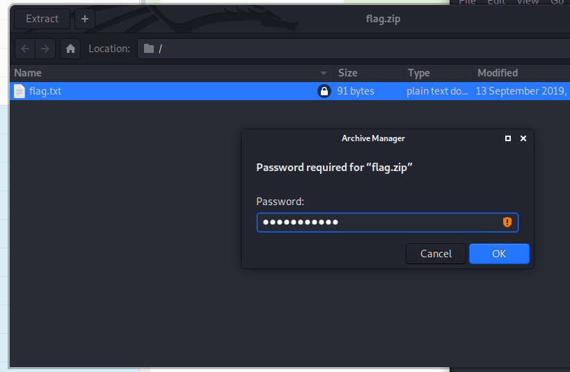
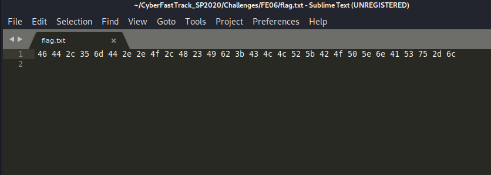
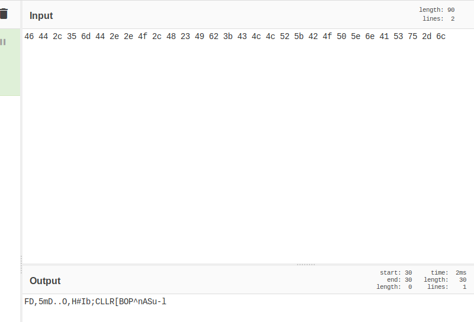
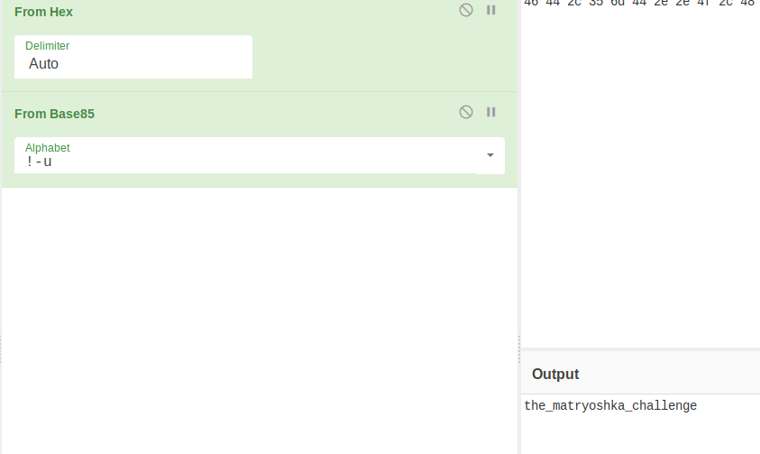

# FE06
## Forensics (Hard)

* [FE06.jpg](FE06.jpg)

For this challenge we are provided with a JPEG image of a locked trunk along with a hint in the form of the "dollmaker" reference. This seems to refer to the famous Russian nesting dolls, indicating that there is some steganography happening here and there is something inside this image.

Checking with a hex editor we see some hex as the bottom of the file (in ascii) and then the repeating bytes 0xDEADBEEF

Using CyberChef to convert from hex and then XOR with DEADBEEF, we reveal "stegception and babushka"

Next we attempt to use steghide to extract files from the image. With the password "babushka" we can extract Flag.zip

Inside this zip file we see an encrypted flag.txt and can extract it using the other password, "stegeception"

Inside this flag file, we see another hex string. However, this one does not use the same XOR encoding as the previous one.

Loading it into CyberChef, we can see that the characters are printable and are alphanumeric plus some punctuation. These characters are not valid base 32 or 64. However, they are valid for base 85!

After adding From Base-85 to the recipe, we reveal the final flag.

