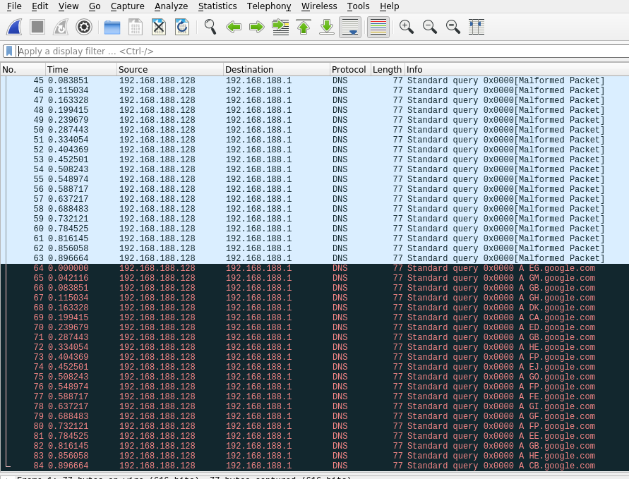

# NM03
## Network (Medium)


This challenge, we are given a pcap file which has a long list of strange DNS packets, which somehow contain the flag. One common method of exfiltrating data using DNS packets is to hide the data in the subdomain portion of the query.



In this case, we can see a series of two letter sudomains that appear to have some sort of significance. However, it isn't valid hex values, base 64, etc. A closer inspection, shows that the second letters of the first four characters "GMBH" are all one off from the letters "FLAG", so that gives us a good starting point to know that there is some sort of counting system in play and not just an XOR cipher. We can also see that only the letters A-P are used (the first 16).

As it turns out, they are using a custom hex system where letters A-P are used insted of A-F and 0-9. We can write a quick python script to decode the subdomain values.

```python
import string

X = "EG GM GB GH DK CA ED GB HE FP EJ GO FP FE GI GF FP EE GB HE CB".split(" ")

L = string.ascii_uppercase[:16]

x = 0

D = {}

for i in L:
    for j in L:
        D[i+j] = chr(x % 255)
        x+=1

for x in X:
    print(D[x],end="")

print("")

```


