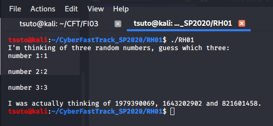
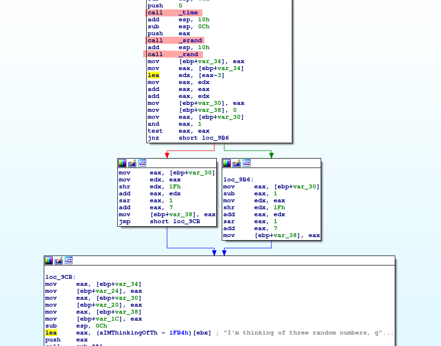

# RH01
## Reverse Engineering (Hard)


For this challenge we are given an executable that asks us to enter three numbers and see if we get the correct answer.



If we examine the program in IDA, we can see that the random number generator is seeded using the current time. So if we know how the numbers are generated, then we can accurately predict what the correct guesses are.



After further investigation, we see that the numbers are generated in a predictable way and we can imitate the process using our own C program.

```c

#include <stdio.h> 
#include <stdlib.h> 
#include<time.h> 
  
int main(void) 
{ 

	char str[80];

	int T = time(0);

    srand(T); 
  
    int num1 = rand();
    uint num2 = (num1 - 3) * 3;
  
    if(num2 & 1 != 0)
    {
    	num2 = num2 - 1;
    }

    int num3 = (int) num2 /2 + 7;

    sprintf(str,"%d %d %d %d",T,num1,num2,num3);

    puts(str);
  
    return 0; 
} 

```

Next we can run both our program, and the provided executable at the same time so they both have the same time seeds.

`./rand_calc && ./RH01`

This prints out the current time, followed by the three numbers, which we can type in and "guess" correctly.


