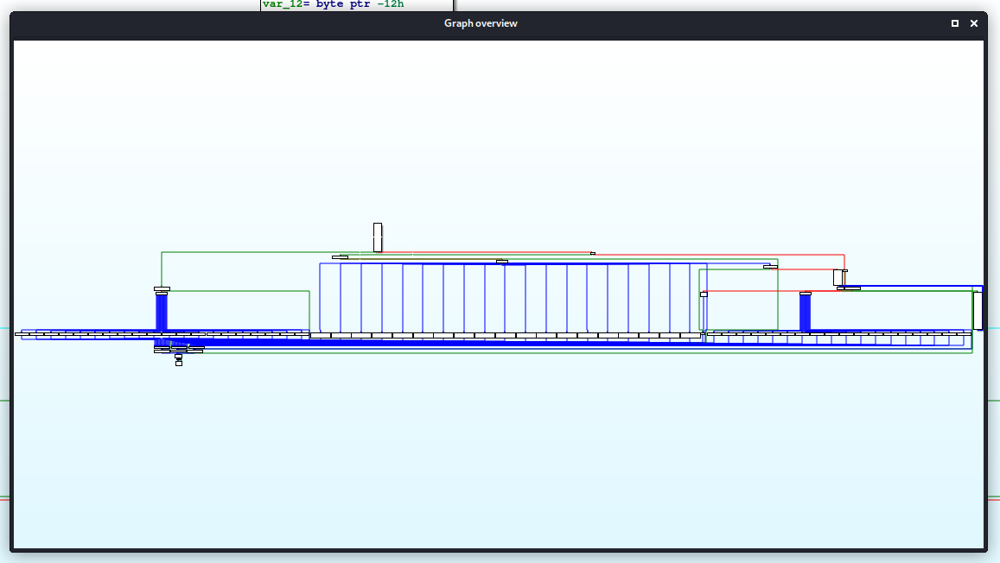
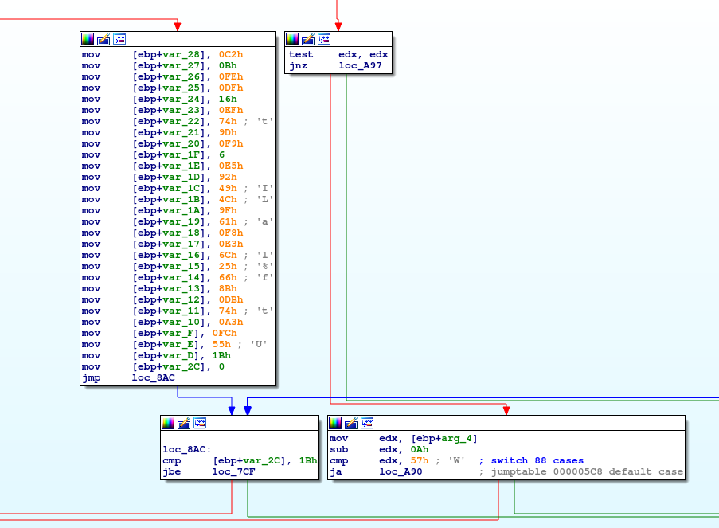
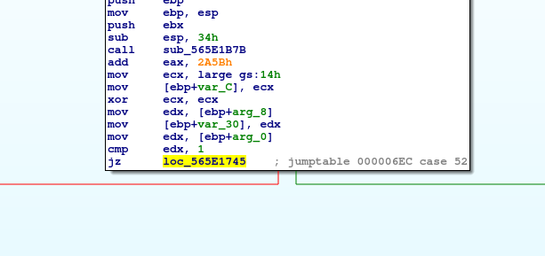
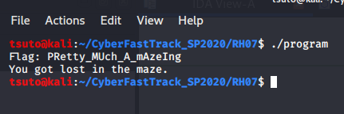

# RH07
# Reverse Engineering (Hard)

This challenge is difficult to reverse engineer because they give you **so much** to look through to understand how the user is actually being sent through "the maze". Upon running the program, you simply see a message that says "You got lost in the maze" without actually knowing what really happend.

Examining the program in IDA, we can see that the main maze function at *0x5660256D* has an absolutely massive set of switch statements and calculations, many of which end up at the failure message.

However, off to the right side there is a block of code at *0x56602753* which appears to contain the flag, which will be decrypted and printed if the program comes through that area.

Since we have complete control of the binary, unlike a binary exploit challenge, this is actually a trivial task. We can actually change the directions of the executable so that no matter what, it will go through the flag printing function.

To do this, we need to patch the program at two locations. First, the JZ (Jump if zero) assembly at *0x56602596* can be changed so that it goes to *0x56602745* instead.

Then the JNZ (Jump if not zero) statement at *0x5660274D* can be changed to JZ. These two provide a direct path from the start of the function execution, to the block of code where the flag is printed.

Re-running the program, we see that the patches work successfully and the flag is revealed.

