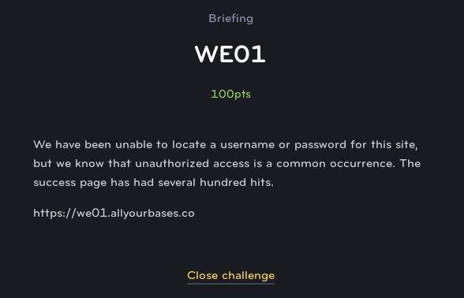

# WE01
## Web Exploit (Easy)

I didn't get a screenshot of this site but you'll notice after you try to log in, that you are directed to a "failure.html" page. HTML has no actual pre-processing like a PHP site does or anything, so it isn't aware of the state of your login session.

So we can simply navigate to success.html and see the flag.
