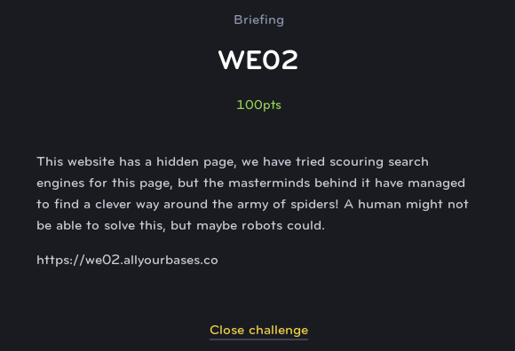

# WE02
## Web Exploit (Easy)

In usual Cyber FastTrack style, they give you a big hint in the brief when they start discussing spiders and robots. It is very common in CTF web challenges, for a flag to be hidden in a file somewhere on the server. And the only clue to its location is in the **robots.txt** file. This file is meant to instruct search engine spiders to ignore certain files and directories and not index them.

If we browse to robots.txt, we see a line that says "disallow" followed by a long file name. Browsing to that file name reveals the flag.
