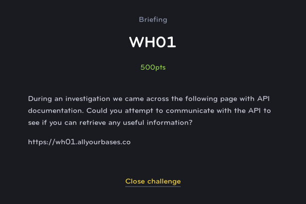

# WH01
## Web Exploit (Hard)

For this challenge we are told that there is an API documentation that we need to use to access the flag. If you look at the documentation you see two items:

* /auth.php - Accepts a name and generates a user token.
* /api/user.php - Accepts a token and gives information about the user.

If you look at the source code of the page though, you see another option commented out:

* /api/admin.php - Accepts an admin level token and gives information about the user.

When you go to auth.php, you'll see a token appear in screen which seems to be base64 encoded. This is actually a JWT token (JSON Web Token), which includes three portions of base64 encoded JSON text: a header, the body, and a signature.

If you decode the token that you are given, you see that there is a user type "user". However we want this to be an "admin" token. But if the whole thing is verified by a signature then how do we change it to still be valid?

It turns out, that the server is actually configured to also accept unsigned JWT tokens as valid as well. We can do this by decoding the header and changing the alg field to "none", then decoding the body and changing the user type to "admin", and finally we can just delete the signature portion.

After doing this, we can create a simple HTML document with a form that submits the modified token using a POST request to the /api/admin.php endpoint.

The API accepts this modified, unsigned token with no question and allows the user access to the flag.
