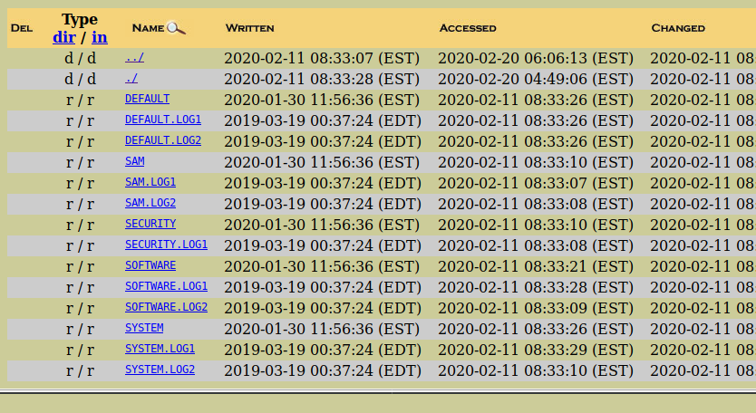

# FE10
## Forensics (Easy)

This challenge requires you to load the **Evidence.E01** file provided for several of the challenges. This is a raw disk image from a Windows PC that we can examine to answer the questions.

For this, we can use Autopsy to create a case and attach the disk image using the web interface:

After we have mounted the image, we can see the a windows file structure. There are other ways that we can find the host name but I chose to use a common registry key to do so. You can find this in the SYSTEM hive at:

`C:/windows/system32/config/SYSTEM`

After downloading the SYSTEM hive, we can access it using the hivexsh tool in Linux, and browse to the following key:

`/ControlSet001/Control/ComputerName/ComputerName`

This reveals the computer name which can be turned in for credit.
