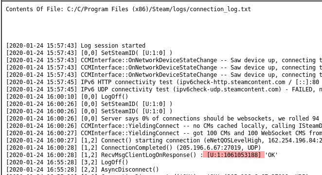

# FE12
## Forensics (Easy)


This challenge requires you to load the **Evidence.E01** file provided for several of the challenges. This is a raw disk image from a Windows PC that we can examine to answer the questions.

For this, we can use Autopsy to create a case and attach the disk image using the web interface:


Next we can browse to the Steam directory and see what we can find in the logs at:

```C:/Programs Files (x86)/Steam/Logs```


In the connection_log.txt file we can see the Steam ID3 of the user who logged in.


