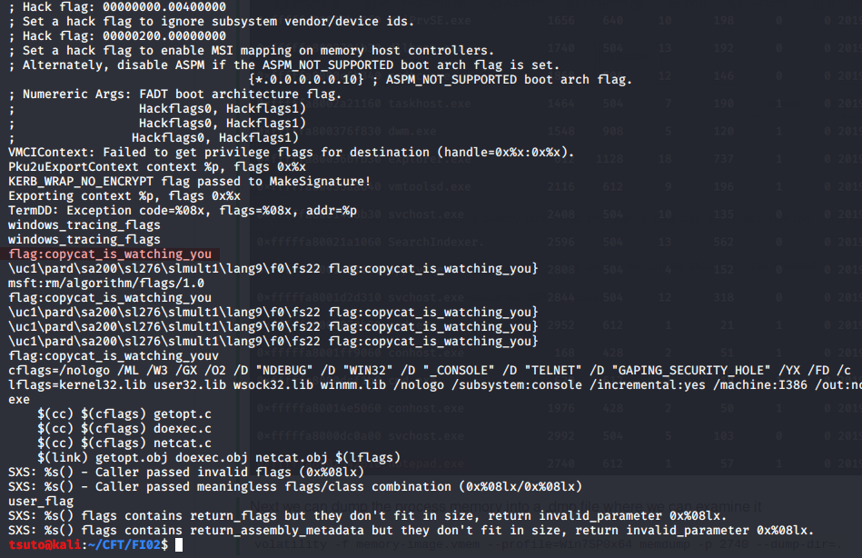

# FH04
## Forensics (Hard)

For this challenge, we must dig into a memory dump from the user's computer as it was running. This can be done using the tool **Volatility**.

First we want to see a list of running processes in the image. We can do this with the command:

`volatility -f memory-image.vmem --profile=Win7SP0x64 pslist`

Here we can see the PID of the notepad.exe process.

Next we can dump the process memory into a .dmp file where we can examine it

`volatility -f memory-image.vmem --profile=Win7SP0x64 memdump -p 2740 --dump-dir=.`

Once the dump has been created, we can take the easy way and grep values from it like "flag":

`strings -n 10 2740.dmp | grep flag`

