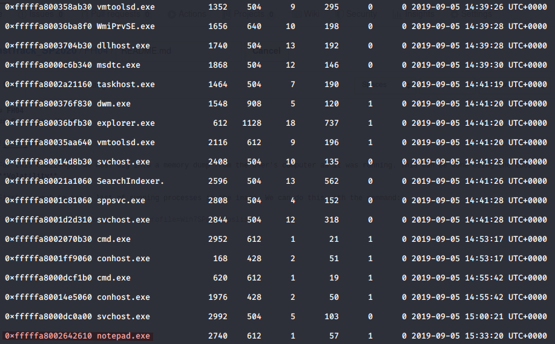
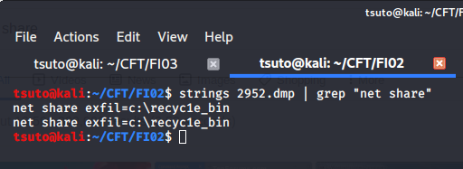

# FH05
## Forensics (Hard)

For this challenge, we must dig into a memory dump from the user's computer as it was running. This can be done using the tool **Volatility**.

First we want to see a list of running processes in the image. We can do this with the command:

`volatility -f memory-image.vmem --profile=Win7SP0x64 pslist`

Here we can see the PID of the cmd.exe process and can dump it's memory.

`volatility -f memory-image.vmem --profile=Win7SP0x64 memdump -p 2952 --dump-dir=.`

Assuming that the hacker used a "net share" command, we can search the dump file and find out.

This reveals the path that was shared on the network.
