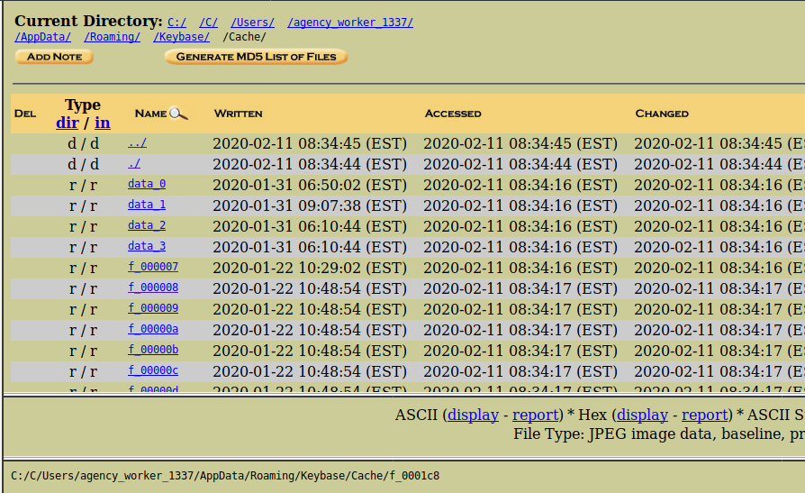

# FH10
## Forensics (Hard)

This challenge requires you to load the **Evidence.E01** file provided for several of the challenges. This is a raw disk image from a Windows PC that we can examine to answer the questions.

For this, we can use Autopsy to create a case and attach the disk image using the web interface:

After we have mounted the image, we can see the a windows file structure. 

A good place to start when searching for applications that have been used by a user is in their AppData folder. A quick look reveals that the user has KeyBase, a chat application.

`C:/Users/agency_worker_1337/AppData/Roaming/Keybase/Cache/`

Inside this cache folder, we can see images that were sent in messages dispite the messages themselves being encrypted. In one of the images, we see the flag.

