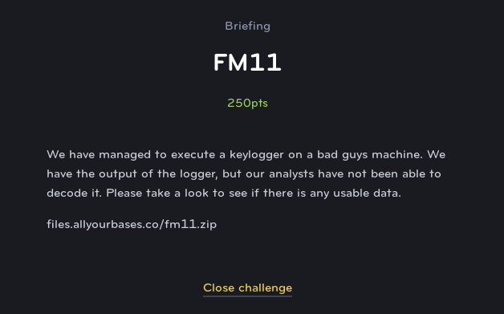
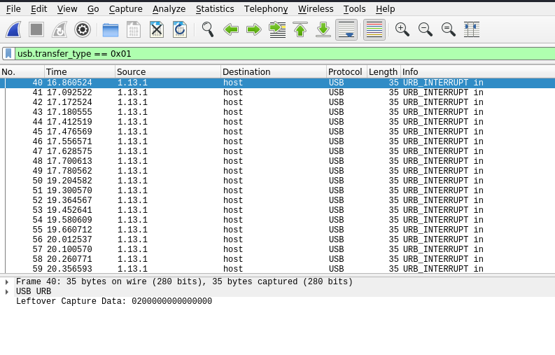

# FM11
# Forensics (Medium)



This is an interesting challenge because we are tasked with recovering USB input that was capture from PCAP. We can filter just the input packets by applying the filter **usb.transfer_type == 0x01**, this reveals capdata which passes a code on each keypress.



We can export these keypresses using the tshark command line tool and save it in output.txt

```
tshark -r FM11.pcap -T fields -e usb.capdata > output.txt
```

While we may be tempted to just try to convert these to ASCII characters, these are actually special key codes just for USB keyboards. With a simple python script, we can convert them back to the actual characters:

```python

newmap = {
2: "",
4: "a",
5: "b",
6: "c",
7: "d",
8: "e",
9: "f",
10: "g",
11: "h",
12: "i",
13: "j",
14: "k",
15: "l",
16: "m",
17: "n",
18: "o",
19: "p",
20: "q",
21: "r",
22: "s",
23: "t",
24: "u",
25: "v",
26: "w",
27: "x",
28: "y",
29: "z",
30: "1",
31: "2",
32: "3",
33: "4",
34: "5",
35: "6",
36: "7",
37: "8",
38: "9",
39: "0",
40: "Enter",
41: "esc",
42: "del",
43: "tab",
44: " ",
45: "-",
47: "[",
48: "]",
56: "/",
57: "CapsLock",
79: "RightArrow",
80: "LetfArrow"
}
myKeys = open('output.txt')
i = 1
for line in myKeys:
    bytesArray = bytearray.fromhex(line.strip())
    #print "Line Number: " + str(i)
    for byte in bytesArray:
        if byte != 0:

            keyVal = int(byte)

            if keyVal in newmap:
                print(newmap[keyVal],end="")
            else:
                continue
    i+=1

print("")
```
After running the script, we can see the keyboard strokes of the user, including the flag.


