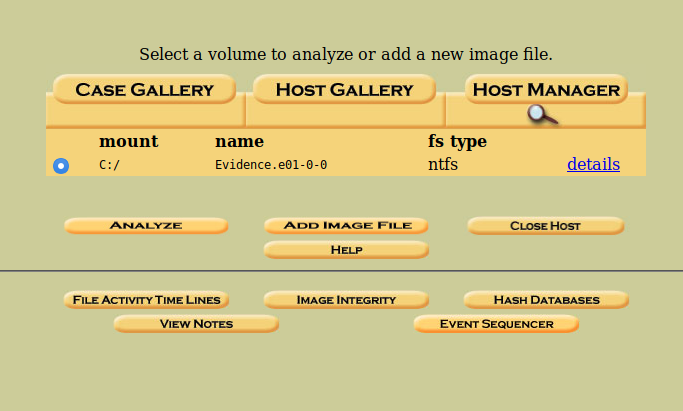
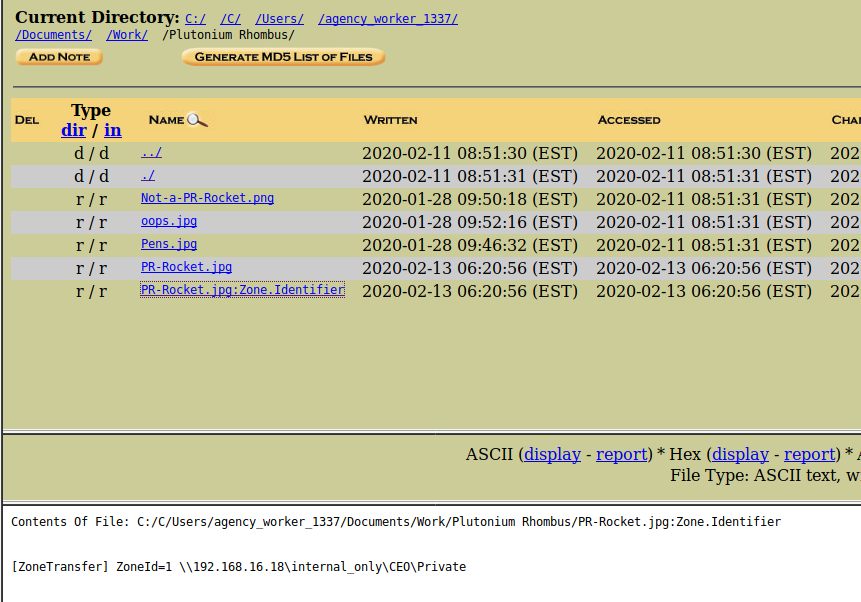

# FM15
## Forensics (Medium)

This challenge requires you to load the **Evidence.E01** file provided for several of the challenges. This is a raw disk image from a Windows PC that we can examine to answer the questions.

For this, we can use Autopsy to create a case and attach the disk image using the web interface:

After we have mounted the image, we can see the a windows file structure. If we believe that the user downloaded a file, then we would obviously want to start by examining his documents folders. This search leads us to:

`C:/Users/agency_worker_1337/Documents/Work/Plutonium Rhombus/`

Where we see an image file, along with a Zone.Identifier file which identifies what "zone" a file came from for security purposes in Windows. Clicking on the file, it reveals that the image was downloaded from a remote server, and lists the location.

This location **\\192.168.16.18\internal_only\CEO\Private** can be submitted for credit.
