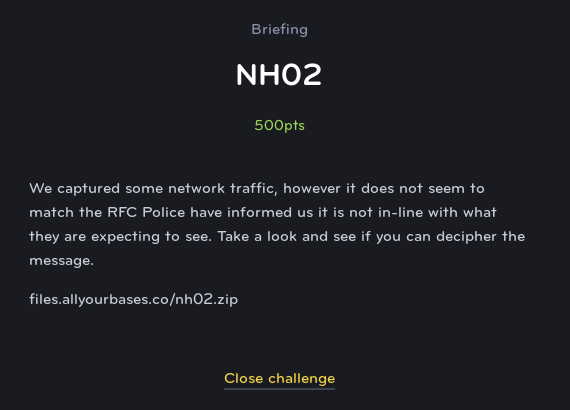
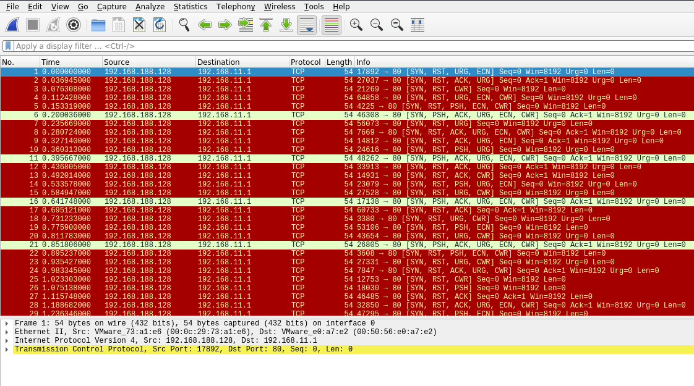
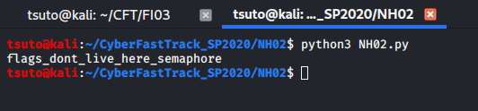

# NH02
## Network (Hard)



For this challenge, we are given a PCAP file that contains a some packets that are somehow signalling a message. The first thing that jumps out is the crazy amount of flags on each packet, almost all of which are innapropriately used.

So we know that a message is being included somehow but the question is how.



As it turns out, this is a case similar to the DNS packets in NM03. Except instead of using the letters A-P to count, we instead use the TCP flags to signal 7 bits of data. Counting up using each of the flags to represent a bit, we can use a simple python script to translate the flags in the packet into ASCII key codes.

```python
X = ["SRUE",
     "SRAU",
     "SRC",
     "SRUEC",
     "SRPEC",
     "SPAUEC",
     "SRU",
     "SRAUEC",
     "SRAUE",
     "SRPU",
     "SPAUEC",
     "SRAU",
     "SRAC",
     "SRPUE",
     "SRUC",
     "SPAUEC",
     "SRA",
     "SRUC",
     "SRPE",
     "SRUC",
     "SPAUEC",
     "SRPEC",
     "SRUC",
     "SRAUC",
     "SRC",
     "SRP",
     "SRA",
     "SRAUEC",
     "SRPE",
     "SRUC"]

count = 0;

Y = {}

for a in ["","S"]:
    for b in ["","R"]:
        for c in ["","P"]:
            for d in ["","A"]:
                for e in ["","U"]:
                    for f in ["","E"]:
                        for g in ["","C"]:

                            Y[a+b+c+d+e+f+g] = count

                            count+=1

for x in X:
    print(chr(Y[x]),end="")

print("")
````


