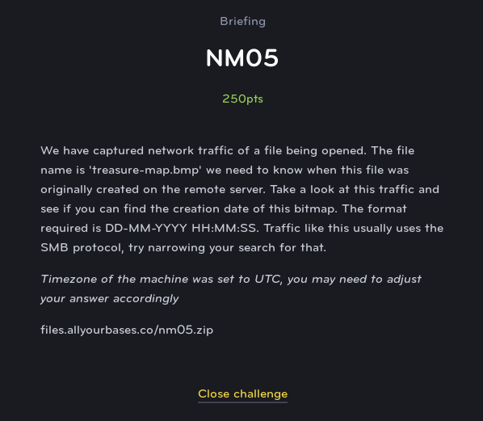
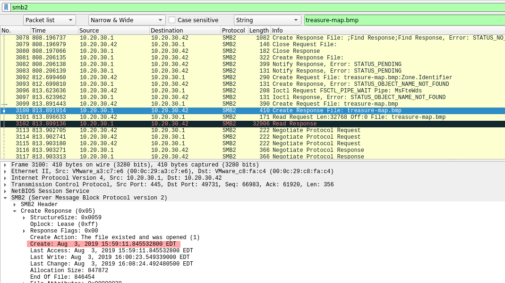

# NM05
# Network (Medium)

For this challenge, we are given a PCAP file containing a large amount of traffic. However, we are given two large clues: the protocol used, and the name of the file.

Filtering with SMB2, and the filename **treasure-map.bmp** we can see a create file response from the server, which contains information about the file that already exists on the server.

This date is in EDT, so we can adjust to UTC (since the creators were kind enough to give that hint halfway through) and submit it.
