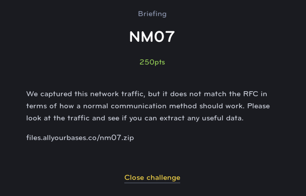

# NM07
# Networking (Medium)

For this challenge we are provided with a PCAP file which contains some interesting looking packets. The first thing that we notice is some interesting SYN/ACK flags that don't really go in the correct order according to what we'd expect to see.

So we are probably expecting that this is using those flags to somehow signal a message. We can use another system of communication that only uses two different flags as well, Morse Code.

If we translate SYN to . and ACK to - with the packets with no flags being spaces, then we are given the following values:

`- . .-.. . --. .-. .- .--. .... .. -. --. .--. .- -.-. -.- . - .... .. ... - --- .-. -.--`

Putting it into an online translator, we reveal the flag.

