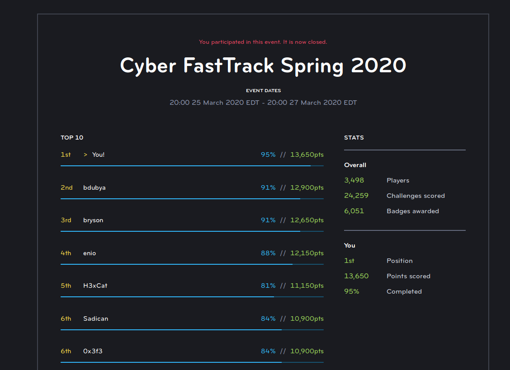

# Cyber FastTrack Spring 2020
Now that the competition has ended, we are free and "encouraged" to share solutions and writeups (according to the email sent by the program organizers shortly before the competition). As the winner, I was able to complete 95% of the challenges but unfortunately just ran out of time/energy when doing FE06 and BM03.

These have been organized by problem type and difficulty:

## General

### Easy
* [CE01](Challenges/CE01)
* [IE01](Challenges/IE01)
* [IE02](Challenges/IE02)
* [OE02](Challenges/OE02)
* [OE03](Challenges/OE03)
* [TE01](Challenges/TE01)
* [TE02](Challenges/TE02)
* [TE04](Challenges/TE04)

### Medium
* [CM08](Challenges/CM08)

## Binary Exploit

### Easy
* [BE03](Challenges/BE03)

### Medium
* [BM02](Challenges/BM02)
* BM03 *(Unsolved)*

### Hard
* [BH04](Challenges/BH04)

### Extreme
* [BX09](Challenges/BX09)
* [BX10](Challenges/BX10)
* [BX11](Challenges/BX11)

## Forensics

### Easy
* [FE01](Challenges/FE01)
* [FE10](Challenges/FE10)
* [FE12](Challenges/FE12)

### Medium
* [FM11](Challenges/FM11)
* [FM15](Challenges/FM15)
* [FM17](Challenges/FM17)
* [FM18](Challenges/FM18)

### Hard
* [FH04](Challenges/FH04)
* [FH05](Challenges/FH05)
* [FH10](Challenges/FH10)
* FE06 *(Unsolved)*

## Network

### Medium
* [NM03](Challenges/NM03)
* [NM05](Challenges/NM05)
* [NM07](Challenges/NM07)

### Hard
* [NH01](Challenges/NH01)
* [NH02](Challenges/NH02)

## Reverse Engineering

### Medium
* [RM03](Challenges/RM03)

### Hard
* [RH01](Challenges/RH01)
* [RH03](Challenges/RH03)
* [RH07](Challenges/RH07)

### Extreme
* [RX04](Challenges/RX04)

## Web Exploits

### Easy
* [WE01](Challenges/WE01)
* [WE02](Challenges/WE02)

### Medium
* [WM01](Challenges/WM01)
* [WM02](Challenges/WM02)
* [WM12](Challenges/WM12)

### Hard
* [WH01](Challenges/WH01)
