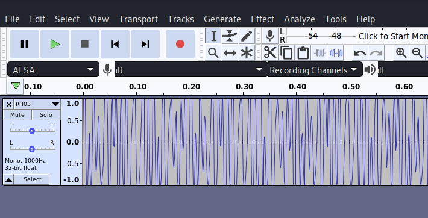
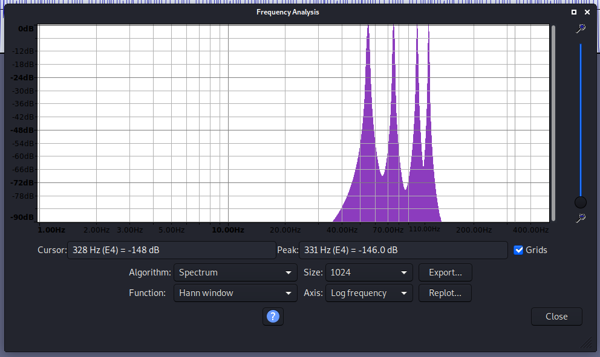

# RH03
## Reverse Engineering (Hard)

For this challenge we are given a wav file that we are told contains a code in some way. The first thing we notice is a very random looking sound wave and also a pattern that appears to repeat over and over.

Examining the file in Audacity, we can use the Analyze -> Plot Spectrum tool to view the spectrum of frequencies used in the file. In this case, we see four distinct peeks at 55 Hz, 75 Hz, 100 Hz, and 115 Hz. Putting these numbers into ASCII, we are given the characters "7Kds"
 

Now we can go to the provided address with the code where the flag is revealed.

`http://rh03.allyourbases.co/7Kds.html`
