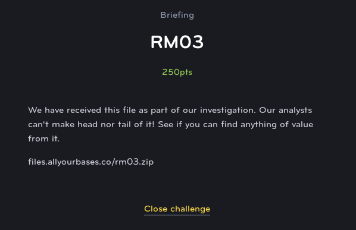
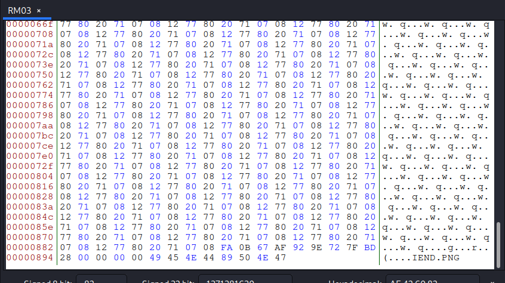

# RM03
## Reverse Engineering (Medium)

This challenge gives us a binary file, however we don't really seem to be able to tell what it is since it doesn't seem to have a recognizeable file header. However, the creators gave us a big hint when they said "head nor tail".

As it turns out, if you open the file in a hex editor and scroll down to the "tail", you'll see the four bytes that make up the PNG file header.

After moving the four bytes from the tail to the head of the file, we are able to open it as a valid PNG, revealing the flag.

