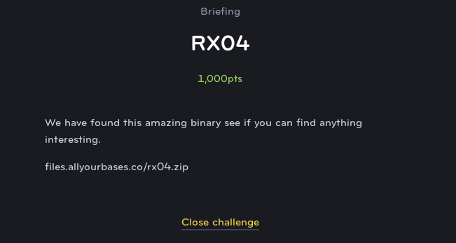
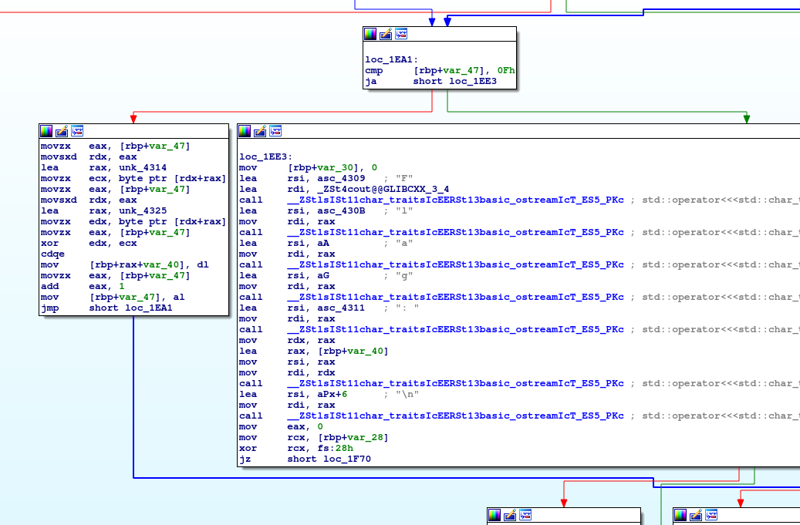
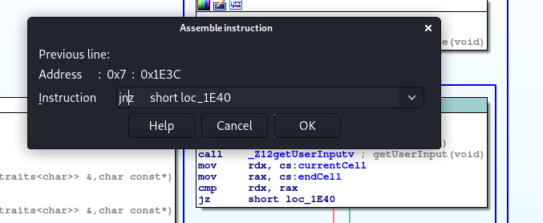

# RX04
## Reverse Engineering (Extreme)

This challenge is another maze challeng. However, now we are able to actually see it on screen and navigate the maze ourselves with the WASD keys. But when you reach the end of the maze each time, you find that the maze gets bigger and you have to do it again. So  much, that it reaches the point where it is unreasonable to solve.

Looking at the program in IDA, we can see a block of code where the flag is printed if the user wins.

Then off to the right, we can see where the user input is reveived and then two variables are compared, the location after the input, and the location of the goal.

So what if we just change this single instruction so that eveery time there is an input, the program believes you've reached the goal? This can be done by changing the instruction from JZ (Jump zero) to JNZ (Jump not zero).

Now, we can simply restart the maze program and press a key and you see that it immediately goes to the next level because it believes that we beat it. After a few levels which get exponentially larger, the flag is revealed.

