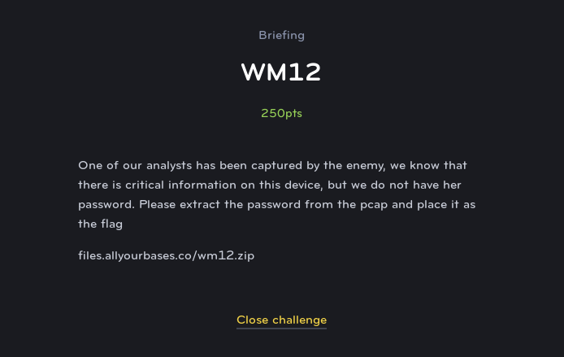

# WM12
# Web Exploit (Medium)

Looking at this challenge, we are provided with a PCAP file of web traffic and are told to obtain the user's credentials. This is actally a very easy task because there are so few packets to look through.

If you know how HTTP basic auth works, the username and password are concatenated with ":" and then sent as a base64 string in the request headers. Wireshark very quickly reveals this information in the first successful GET request in the capture, and is even so kind as to decode it for us.

